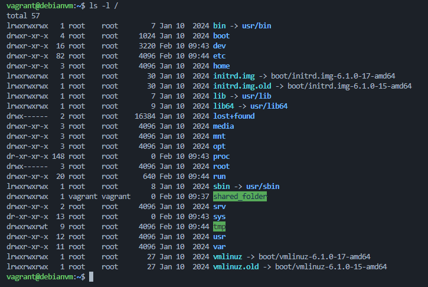
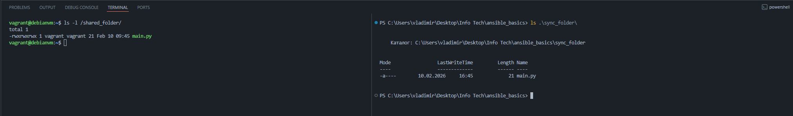

# Задача

Настройте виртуальную машину с Debian 12, подготовьте Ansible-инвентарь и создайте playbook, который автоматически установит LAMP-стек и WordPress (или Joomla) предпоследней версии. Убедитесь, что CMS запускается и доступна по IP. Документируйте все шаги запуска сценария.

# Глоссарий

LAMP — это акроним, обозначающий набор из четырех технологий для развертывания веб-приложений:
- L - Linux      (Операционная система)
- A - Apache     (Веб-сервер)
- M - MySQL      (Система управления базами данных)
- P - PHP        (Язык программирования)

# Декомпозиция задачи

1. Создать локальную виртуальную машину (хост, он же управляемый узел)
2. Создать инвентарь на языке YAML для сценария
3. Создать сценарий (playbook) установки компонентов, необходимых для запуска Wordpress
   1. Веб-сервер Apache
   2. База данных MySQL
   3. Среда исполнения кода PHP (Backend)
   4. Система управления контентом Wordpress
4. Выполнить сценарий и зафиксировать результат

# Vagrant

#### Что такое Vagrant
Vagrant — это инструмент для создания и управления виртуальными средами разработки в одном рабочем процессе. Он позволяет автоматизировать создание виртуальных машин, делая окружения воспроизводимыми и портативными

Архитектура Vagrant
```
Ваш компьютер (Host)
    ↓ (Vagrant CLI)
Vagrant
    ↓ (драйвер)
Провайдер (VirtualBox, VMware, Docker, etc.)
    ↓ (образ)
Виртуальная машина (Guest)
```

Vagrant Box — это упакованный, предварительно настроенный образ виртуальной машины, который можно легко развернуть с помощью Vagrant. В проекте использован [публичный Vagrant Box](https://portal.cloud.hashicorp.com/vagrant/discover/generic/debian12)

#### Настройка конфигурации и запуск виртуальной машины

Для того, чтобы запустить виртуальную машину, необходимо подготовить специальный файл Vagrantfile, который содержит описание виртуалки, а также настройки провайдера, на котором она будет запущена. Содержимое файла конфигурации описывается на [языке программирования Ruby](https://www.ruby-lang.org/ru/), однако преимущественно используется синтаксис для присваивания значения переменным конфигурации

Файл Vagrantfile можно создать вручную или с помощью команды `vagrant init`, которая сгенерирует файл с базовыми настройками и структурой:
```bash
# Создать Vagrantfile для запуска виртуальной машины из образа generic/debian12 версии 4.3.12
vagrant init generic/debian12 --box-version 4.3.12
```

Небольшое отступление про синтаксис Ruby:
```ruby
# Синтаксис Ruby для вызова метода provider с передачей в него аргументов
# "virtualbox" и анонимной функции do |vb| end
config.vm.provider "virtualbox" do |vb|
  ...
end

# Примерный аналог на JavaScript
config.vm.provider("virtualbox", function(vb) {
  ...
});
```

Настройки конфигурации ВМ прописываются в файле Vagrantfile в проекте. Пример настроек с описанием:
```ruby
# -*- mode: ruby -*-
# vi: set ft=ruby :

# "2" в Vagrant.configure - актуальная версия API Vagrant для управления конфигурацией
Vagrant.configure("2") do |config|

  # Конфигурация для запуска ВМ на debian
  # Для запуска выполнить в CLI: vagrant up debian
  config.vm.define "debian" do |debian|
    # Образ, на базе которого необходимо поднять ВМ
    debian.vm.box = "generic/debian12"
    # Версия образа
    debian.vm.box_version = "4.3.12"
    # Имя хоста (отображается в строке-приглашении при подключении к ВМ)
    debian.vm.hostname = "debianvm"
    # Создать приватную сеть для подключения к ВМ только с хоста (без доступа во внешнюю сеть)
    # Позволяет задать специфичный IP для ВМ
    debian.vm.network "private_network", ip: "192.168.33.10"

    # Настройка синхронизации директории хоста и виртуальной машины для общего доступа к файлам
    # Первый аргумент - путь к директории на хосте
    # Второй аргумент - путь к директории на виртуальной машине
    config.vm.synced_folder "./data", "/vagrant_data"
  end

  # Конфигурация для запуска ВМ на ubuntu
  # Для запуска выполнить в CLI: vagrant up ubuntu
  config.vm.define "ubuntu" do |ubuntu|
    ubuntu.vm.box = "ubuntu/trusty64"
    ubuntu.vm.box_version = "20191107.0.0"
    ubuntu.vm.hostname = "ubuntuvm"
    ubuntu.vm.network "private_network", ip: "192.168.33.11"
  end

  # Настройки провайдера (гипервизора)
  config.vm.provider "virtualbox" do |vb|
    # Имя машины, отображаемое в VirtualBox
    vb.name = "my_virtual_machine"
    # Объём оперативной памяти, выделенный ВМ (в МБ)
    vb.memory = "2048"
    # Количество ядер процессора, выделенных под машину
    vb.cpus = 2
    # Отображение графического интерфейса VirtualBox GUI при запуске машины
    vb.gui = false
  end
end
```

Запуск виртуальной машины:
```bash
# Т.к. в файле конфигурации я указал несколько ВМ, аргументом нужно указать, какую требуется запустить
vagrant up debian
```

Основные команды Vagrant CLI
```bash
# Создание файла с настройками ВМ
vagrant init generic/debian12 --box-version 4.3.12

# Запуск ВМ
vagrant up

# Подключение по SSH
vagrant ssh

# Остановка ВМ
vagrant halt

# Перезагрузка
vagrant reload

# Удаление ВМ
vagrant destroy

# Проверка статуса
vagrant status
```

#### Подключение к виртуальной машине по SSH

```bash
# Использую IP-адрес, заданный в конфиге Vagrant с использованием ключа, созданного при первом запуске виртуальной машины
ssh vagrant@192.168.33.10 -i .\.vagrant\machines\debian\virtualbox\private_key
```

#### Пример работы синхронизации директории

Содержимое в корне виртуальной машины



На хосте добавлен файл `main.py` в директорию проекта `./sync_folder/`. Этот же файл подтянулся на виртуалку в `/shared_folder/`



#### Поиск Vagrantfile
При выполнении любой vagrant команды Vagrant поднимается вверх по дереву каталогов в поисках первого найденного файла Vagrantfile, начиная с текущего каталога. Таким образом, если вы запустите команду vagrant в /home/mitchellh/projects/foo, он будет искать файл Vagrantfile по следующим путям в указанном порядке, пока не найдет его:

```
/home/mitchellh/projects/foo/Vagrantfile
/home/mitchellh/projects/Vagrantfile
/home/mitchellh/Vagrantfile
/home/Vagrantfile
/Vagrantfile
```

Эта функция позволяет запускать виртуальные машины с помощью vagrant из любой директории вашего проекта

# Installation

Установка Ansible

```bash
pipx install --include-deps ansible
```

Настройка виртуальной машины


# Запуск сценария

Для подключения к виртуальной машине можно использоавть ключ для дефолтного пользователя `vagrant`, который располагается в директории проекта `.vagrant/machines/default/virtualbox/`

Утилита ssh предъявляет требования безопасности для приватного ключа. Для корректной настройки прав к ключу и его использования при работе Ansible из под WSL, секретный ключ перемещен в домашнюю директорию с ограничением прав доступа только для владельца файла:

```bash
cp .vagrant/machines/default/virtualbox/private_key ~/.ssh/debian_private_key
chmod 600 ~/.ssh/debian_private_key
ls -l ~/.ssh/debian_private_key
-rw------- 1 vladimir vladimir 400 Feb 10 18:19 /home/vladimir/.ssh/debian_private_key
```

Проверка доступности хоста:
```bash
$ ansible vbox_hosts -i ./hosts -u vagrant --private-key=/home/vladimir/.ssh/debian_private_key -m ping
[WARNING]: Host '192.168.33.10' is using the discovered Python interpreter at '/usr/bin/python3.11', but future installation of another Python interpreter could cause a different interpreter to be discovered. See https://docs.ansible.com/ansible-core/2.20/reference_appendices/interpreter_discovery.html for more information.
192.168.33.10 | SUCCESS => {
    "ansible_facts": {
        "discovered_interpreter_python": "/usr/bin/python3.11"
    },
    "changed": false,
    "ping": "pong"
}
```

#### Простейший плейбук для проверки

```yml
---
- hosts: vbox_hosts
  become: true
  tasks:
  - name: Show hostname
    ansible.builtin.command: hostname
    register: hostname_result

  - name: Test message
    ansible.builtin.debug:
      msg: "Hostname is: {{ hostname_result.stdout }}"
```

Запуск (часть вывода удалена для более компактного отображения)

```bash
# Данные для подключения к хосту указаны в инвентаре
ansible-playbook playbook.yml -i hosts

PLAY [vbox_hosts] *******************************************************

TASK [Gathering Facts] **************************************************
ok: [192.168.33.10]

TASK [Show hostname] ****************************************************
changed: [192.168.33.10]

TASK [Test message] *****************************************************
ok: [192.168.33.10] => {
    "msg": "Hostname is: debianvm"
}

PLAY RECAP **************************************************************
192.168.33.10              : ok=3    changed=1    unreachable=0    failed=0    skipped=0    rescued=0    ignored=0
```